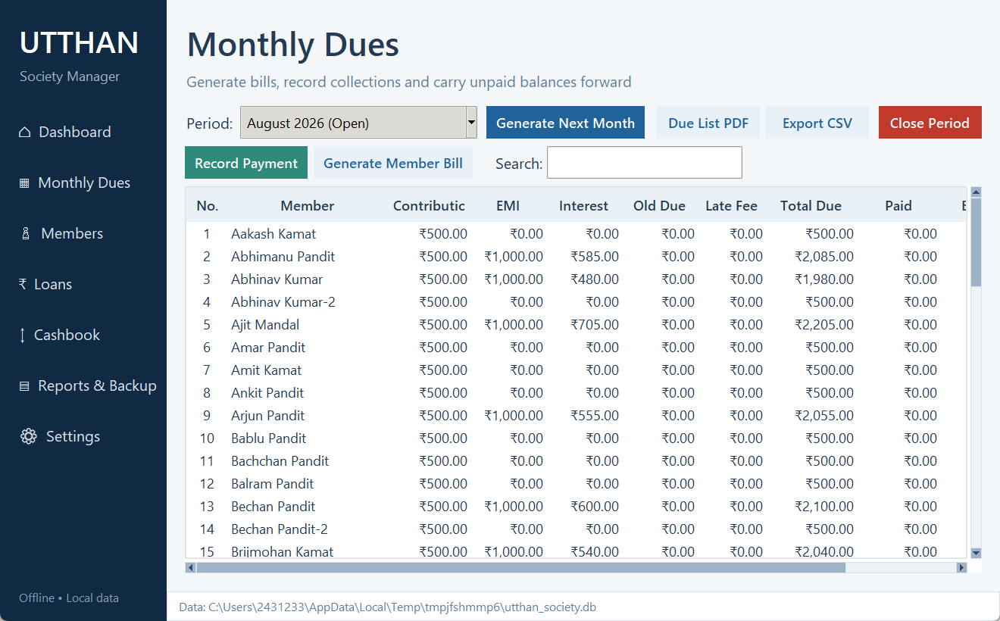

# Utthan Society Manager

Offline Windows software for member savings, internal loans, monthly dues, receipts and local record keeping.

## Ready-to-use application

Open `dist/Utthan-Society-Manager.exe`. No Python installation is required on the computer that runs the EXE.

On first launch, the application creates its database and imports the 60 members and August 2026 opening balances from the attached due-list PDF.

## Included features

- dashboard with savings, loans, interest, expenses and available funds;
- member register;
- fresh and top-up loans;
- reducing-balance interest and EMI calculation;
- monthly due generation;
- old-due and late-fee tracking;
- full or partial payment entry;
- printable monthly due lists, member bills and payment receipts;
- cashbook and expenses;
- CSV export;
- local backup and restore;
- audit log in the database;
- configurable contribution, EMI and interest defaults.

## Data location

The EXE stores working data outside its installation folder:

`%LOCALAPPDATA%\UtthanSociety\utthan_society.db`

Generated reports and backups are stored below the same folder. Their exact locations are displayed inside the application.

Create a backup regularly and copy important backups to another physical drive. Data remains only on the local computer unless a user manually copies it elsewhere.

## Recommended monthly process

1. Review the previous month's unpaid balances.
2. Close the previous period after all intended entries are made.
3. Select **Generate Next Month**.
4. Review the automatically calculated contribution, EMI, interest and carried due.
5. Create the due-list PDF or member bills.
6. Record each payment; the application updates savings and loan balances and creates a receipt.
7. Enter expenses and reconcile the cashbook with cash/bank holdings.
8. Create a backup.

## Source rules imported

The attached August 2026 PDF indicates:

- monthly contribution: ₹500 per member;
- EMI: ₹1,000 for borrowers;
- interest: 1.5% per month on opening outstanding loan balance;
- 60 members;
- opening member contributions: ₹15,90,000;
- loans in circulation: ₹10,77,000;
- previous interest: ₹1,48,085.

See [docs/RESEARCH_AND_DESIGN.md](docs/RESEARCH_AND_DESIGN.md) for the complete analysis, verified totals, official references, design and legal/accounting cautions.

## Development

Requirements: Python 3.14 or a compatible current Python 3 version.

- Start from source: `python app.py`
- Run tests: `python -m unittest discover -s tests -v`
- Rebuild EXE: run `scripts/build.ps1`

## Important scope note

This application maintains records; it is not legal, tax or audit advice and does not confer authority to accept public deposits or conduct regulated banking. Confirm the organisation's legal form and accounting policy with a qualified local professional before treating it as the final statutory ledger.
