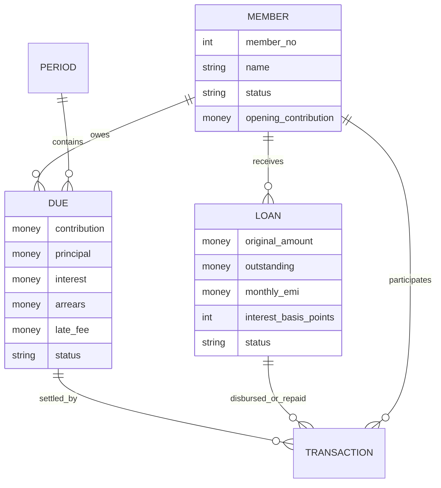
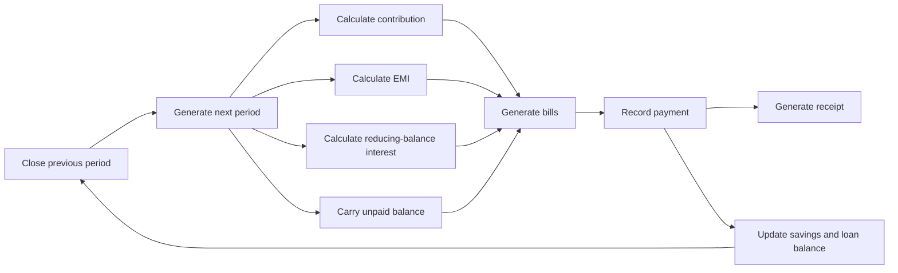

# Utthan Society Manager — Research and Design

Date: 30 August 2026

## 1. What this organisation appears to be

The attached August 2026 document calls the organisation both **UTHAN CREATIVE SOCIETY** and **UTTHAN SELF HELP GROUP**. Operationally, it acts as a member savings-and-internal-lending group:

1. Members make a fixed periodic contribution.
2. The pooled corpus is lent to members.
3. Borrowers repay principal and interest each month.
4. Interest and late fees become group income.
5. Expenses reduce the group's available funds.
6. A due list is prepared for every collection period.

The source has 60 members. Traditional SHGs commonly use smaller groups, so the exact legal form (informal SHG, registered society, thrift/credit co-operative, or another member association) should be confirmed with the organisation's accountant or the applicable State Registrar. The software is a record-keeping tool; it does not itself authorise public deposit-taking or lending.

## 2. Findings from authoritative guidance

### RBI financial-literacy material for SHGs

The Reserve Bank of India's *Financial Literacy for Self Help Groups* explains that:

- members normally contribute fixed compulsory savings at weekly, fortnightly, or monthly meetings;
- the group may also permit voluntary savings;
- the group decides internal-loan purpose, amount, interest rate and repayment schedule;
- regular meetings, regular savings, internal lending and timely repayment are core practices;
- membership, minutes, attendance, cashbook, member-wise thrift/savings, voluntary savings and internal loans should be kept current;
- reliable bookkeeping supports transparency, financial assessment, bank linkage and performance grading.

Source: [RBI — Financial Literacy for Self Help Groups](https://www.rbi.org.in/FinancialEducation/content/04SELFHELP20042018.pdf)

### RBI SHG–Bank Linkage guidance

RBI's master circular recognises SHGs as a link between formal banking and rural members. A system should therefore preserve bank-related identity, balances, loan history and repayment performance if bank linkage is later added.

Source: [RBI — Master Circular on SHG–Bank Linkage Programme](https://www.rbi.org.in/commonman/English/scripts/Notification.aspx?Id=3012)

### DAY–NRLM handbook

The DAY–NRLM handbook treats savings and internal lending as continuous SHG activities. It emphasises gradual growth in member savings, internal-lending recovery, interest income, bank-loan tracking and repeat-credit readiness.

Source: [DAY–NRLM — A Handbook on SHG–Bank Linkage](https://banklinkage.lokos.in/Circulars/Handbook%20on%20SHG.pdf)

### NABARD training material

NABARD training guidance covers meetings, savings, internal loans, loan appraisal, repayment capacity, voluntary savings, record writing, audits, member savings/loan particulars and repayment tracking.

Source: [NABARD — Training Handbook](https://www.nabard.org/auth/writereaddata/tender/0409173705HANDBOOK_ON_TRAINING_REVISED_2013_14.pdf)

## 3. Rules inferred from the attached PDF

The August 2026 due list contains 60 members and these consistent rules:

| Rule | Inferred value |
|---|---:|
| Monthly member contribution | ₹500 |
| Borrower principal EMI | ₹1,000, limited by remaining balance |
| Monthly interest | 1.5% of opening outstanding loan |
| Interest method | Reducing balance |
| Contribution balance before August | ₹26,500 per member |
| Contribution balance after August | ₹27,000 per member |

The calculation is:

$$
\text{Interest} = \operatorname{round}(\text{Opening loan balance} \times 0.015)
$$

$$
\text{Current-month payable} = \text{Contribution} + \text{Principal EMI} + \text{Interest}
$$

Old due and late fee are tracked separately:

$$
\text{Grand payable} = \text{Current-month payable} + \text{Old due} + \text{Late fee}
$$

### Totals verified from the PDF

| Item | PDF total |
|---|---:|
| Opening member contributions | ₹15,90,000 |
| August contributions | ₹30,000 |
| Principal EMI | ₹37,000 |
| August interest | ₹16,155 |
| Current-month payable | ₹83,155 |
| Opening loans in circulation | ₹10,77,000 |
| Scheduled loan balance after EMI | ₹10,40,000 |
| Contributions after August | ₹16,20,000 |
| Carried old dues | ₹7,030 |
| Late fee | ₹270 |
| Historical total loan amount issued | ₹21,28,000 |
| Previous interest | ₹1,48,085 |
| Maintenance expense shown | ₹500 |

Two members have carried dues: Manish Mandal ₹3,235 and Siddharth Kumar ₹3,795. Siddharth Kumar also has a ₹270 late fee.

### Source inconsistency handled by the software

The summary's “Total Earning on Principal” shows ₹1,63,740, while ₹1,48,085 + ₹16,155 equals ₹1,64,240. The ₹500 difference equals the maintenance expense. The source simultaneously uses ₹1,64,240 when calculating its grand total. The new system avoids this ambiguity by keeping these as separate ledgers:

- interest income;
- late-fee income;
- member contributions;
- loan principal;
- expenses;
- cash/bank movement.

## 4. Product design

### Core screens

1. **Dashboard** — members, savings, loan circulation, interest, expenses, available funds and monthly collection progress.
2. **Monthly Dues** — generate a period, review each member's contribution/EMI/interest/arrears/late fee, record full or partial payments, print bills and close a period.
3. **Members** — member register, contact information, nominee, join date, savings balance and status.
4. **Loans** — fresh/top-up loans, issue date, original amount, outstanding balance, member-specific EMI and interest rate.
5. **Cashbook** — receipts, loan disbursements, expenses, payment method and UTR/reference.
6. **Reports & Backup** — due-list PDF, individual bill PDF, payment receipt PDF, CSV export and local database backups.
7. **Settings** — society name and configurable defaults.

### Data model

All money is stored as integer paise, not floating-point values. Historical dues retain the values in effect when generated. Every major action is written to an audit log.

### Monthly workflow

## 5. Technology and security

- Windows desktop executable built with Python and Tk/ttk.
- SQLite database stored under the signed-in user's local application-data directory.
- No internet or cloud account is required.
- PDF reports use ReportLab.
- One-file Windows executable is built with PyInstaller.
- Backups use SQLite's online backup mechanism and can be copied to another drive.

Recommended controls before production use:

- nominate authorised operators;
- add periodic external backup and test restoration;
- reconcile cash and bank balances after every meeting;
- retain signed vouchers/minutes for loan approval and expenses;
- obtain professional advice about the group's registration, tax, audit, KYC and permitted lending/deposit activity;
- do not store Aadhaar numbers unless legally necessary, appropriately consented to and securely protected.

## 6. Delivered scope

The first version implements the attached August 2026 balances, monthly automation, collections, bills, receipts, loans, expenses, reports, backups and configurable defaults. Meeting minutes, attendance, bank reconciliation, role-based passwords, dividend distribution and formal financial statements are suitable next-phase modules after the exact constitution and accounting policy are confirmed.
